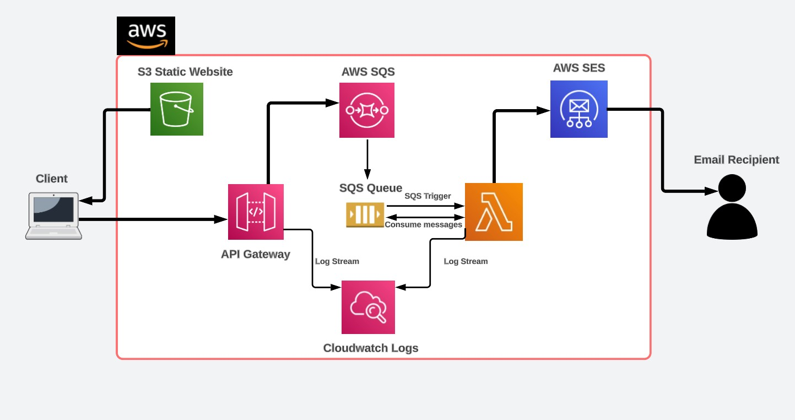

# Emailing Service using AWS
## About:

This project utilizes AWS services such as API Gateway, SQS, Lambda and SES in an Event driven fashion to send emails to a recipient from an S3 static website(consists of a form). The architecture follows AWS practices for Asynchoronous invocations of Lambda functions by using SQS Queues, hence decoupling the Lambda function and the API Gateway.

**Architecture**:

## Implementation:
- Set up AWS SES with the desired email address and note the SMTP host, username and password which will be used in the Lambda function code.

- Create a Lambda function with code similar to `lambdaFunction.py`, make necessary changes.

- Create an SQS queue which will be used to store messages from the API Gateway and invoke the Lambda function. Configure this SQS queue to act as a trigger for the Lambda function.

- To configure API Gateway integration with SQS, refer https://repost.aws/knowledge-center/api-gateway-rest-api-sqs-errors

- Create an S3 bucket, enable public access and use the `index.html` and `main.js` files(as reference) to host a public website. Ensure to insert the API Gateway URL that will be invoked in the form present in the `index.html` file.

- To allow the S3 static website to invoke the API Gateway, CORS needs to be enabled. Use https://docs.aws.amazon.com/apigateway/latest/developerguide/how-to-cors-console.html for more information.

## Working:
<video src="Inbox%20(6,606)%20-%20arvindrox.619@gmail.com%20-%20Gmail%20-%20Google%20Chrome%202023-07-18%2017-01-58.mp4" controls title="Title"></video>